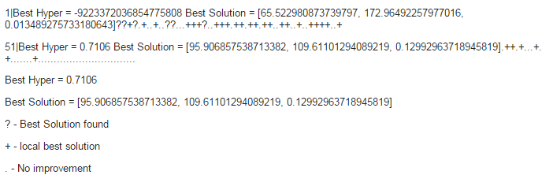

#Code 10

# Hyper parameter optimization

## I. Abstract:

Genetic algorithm is a search heuristic that mimics the process of natural selection. It is routinely used to generate useful solutions to optimization and search problems. Our previous work involved implementation od Standard Genetic Algorithm. This project aims at optimizing the default parameters of Standard Genetic Algorithm using Differential Evolution.   

## II. Introduction:   

#### Genetic Algorithm:

A genetic algorithm is a method for solving both constrained and unconstrained optimization problems based on a natural selection process that mimics biological evolution. The algorithm repeatedly modifies a population of individual solutions. At each step, the genetic algorithm randomly selects individuals from the current population and uses them as parents to produce the children for the next generation. Over successive generations, the population "evolves" toward an optimal solution.

We can apply the genetic algorithm to solve problems that are not well suited for standard optimization algorithms, including problems in which the objective function is discontinuous, nondifferentiable, stochastic, or highly nonlinear.

The genetic algorithm differs from a classical, derivative-based, optimization algorithm in the following two main ways:

* Generates a population of points at each iteration.
* Selects the next population by computation which uses random number generators.

#### Differential Evolution

Differential evolution optimizes a problem by iteratively trying to improve a candidate solution with regard to a given measure of quality. It makes few or no assumptions about the problem being optimized and can search very large spaces of candidate solutions. However, metaheuristics such as DE do not guarantee an optimal solution is ever found.

DE is used for multidimensional real-valued functions but does not use the gradient of the problem being optimized, which means DE does not require for the optimization problem to be differentiable as is required by classic optimization methods such as gradient descent and quasi-newton methods. DE can therefore also be used on optimization problems that are not even continuous, are noisy, change over time, etc.

DE optimizes a problem by maintaining a population of candidate solutions and creating new candidate solutions by combining existing ones according to its simple formulae, and then keeping whichever candidate solution has the best score or fitness on the optimization problem at hand. In this way the optimization problem is treated as a black box that merely provides a measure of quality given a candidate solution and the gradient is therefore not needed.

## III. Implementation:

* SettingModel
  * lo = [50,100,0.01]
  * hi = [150,1000,0.15]
  * Decisions - 3
    * Candidates, Generations, Mutate Probability
  * Objectives - 1
    * Hypervolume of the GA
    
* Create a frontier of randomly chosen settings
* Run DE on each setting as a candidate 
  * the energy score of each candidate will be the hypervolume from GA. 
  * GA runs with the settings from DE using the Kursawe model
  * Exit
    * When there is no improvement in the era from the previous era
    * maximum tries reached

## IV. Results: 

Parameters of GA were tuned using DE such that hypervolume of GA is maximized.  The results below show the best solution which is the set of optimized parameters for GA.

 
## V. Threats to validity:

* Consideration of metrics other than Hyper volume could lead to different results
* Results may vary if other models are used for tuning the GA parameters
* The efficiency of boolean domination in differentiating certain generations

## VI. Future Work:

* Improving on the run time and memory requirements of the program
* Exploring techniques other than DE to optimize GA parameters
* Replacing boolean domination with continuous dominaition