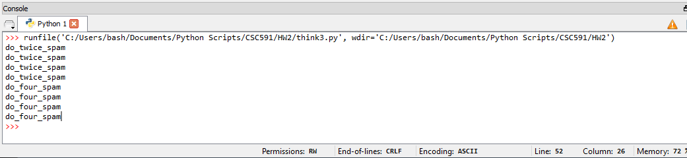

## CODE 2

### Exercise 3

Code for exercise 3 is in [think3.py](./think3.py)

1. Move the last line of this program to the top, so the function call appears before the definitions. Run the program and see what error message you get.
  

2. Move the function call back to the bottom and move the definition of print_lyrics after the definition of repeat_lyrics. What happens when you run this program?
  

3. Write a function named right_justify that takes a string named s as a parameter and prints the string with enough leading spaces so that the last letter of the string is in column 70 of the display.
  

4.

* Use the modified version of do_twice to call print_twice twice, passing 'spam' as an argument.
 

* Define a new function called do_four that takes a function object and a value and calls the function four times, passing the value as a parameter. There should be only two statements in the body of this function, not four.
  

5.

* Write a function that draws a grid like the following
  

* Write a function that draws a similar grid with four rows and four columns.
  

### Exercise 4

Code for exercise 4 is in [think4.py](./think4.py)

2. Images of turtle flowers:

  

3. Images of turtle pies:

  