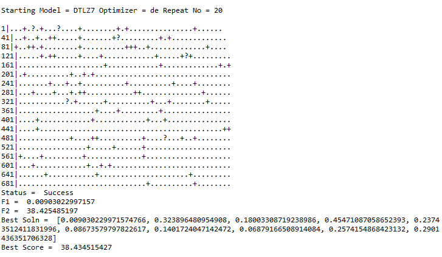
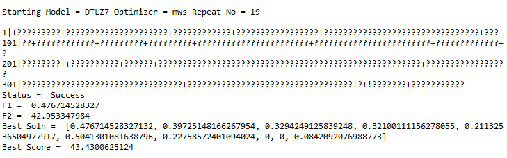
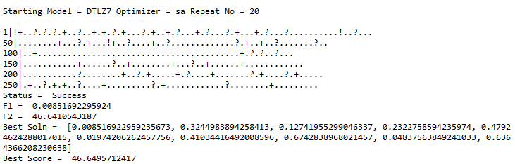
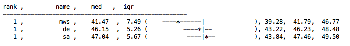

#Code 8

# Implementing Types of "less than" for Optimizers

## I. Abstract:
    
Algorithms like Simulated Annealing, MaxWalkSat and Differential Evolution help us in finding the most optimal solution  in an efficient manner. Conventional methods arrive at optimal solution by compairng all the possible candidate solutions, which grow exponentially with the size of the data.This work presents a comparison of the performace of the three optimizers Simulated Annealing, MaxWalkSat and Differential Evolution. The model used for the project was DTLZ7. To evaluate the performance of the optimizers against one another, statistical machinery like Scott-Knott, a12, bootstrap were used.

## II. Background and Implementation:   

#### Simulated Annealing
Simulated annealing (SA) is a method for solving unconstrained and bound-constrained optimization problems. The method models the physical process of heating a material and then slowly lowering the temperature to decrease defects, thus minimizing the system energy.<br>

```
* A baseline study is generated
* At each iteration of the simulated annealing algorithm, a new candidate is randomly generated. 
* Type 1 comparison is performed between the best solution and new candidate 
    * If the new candidate is better update best solution
* Type 1 comparison is performed between the new candidate and local solution
    * If the new candidate is better update local solution
* After the era size
    * Type2 comparison between era and era - 1
* Exit 
    * if ran out of lives
    * if optimum energy is reached
    * if ran out of generations
```
#### MaxWalkSat

MaxWalkSat is a non-parametric stochastic method for sampling the landscape of the local region. Historically speaking, MaxWalkSat was a very impactful algorithm. But, at least here, the real purpose of discussing MaxWalkSat is to introduce the idea of landscapes. It will be argued that more important than the algorithms is the shape of the space they search. Since this shape can change, it is not possible to prove the adequacy of these meta-heuristics unless you first characterize the space they are trying to explore.

```
* A baseline study is generated
* At each iteration of max_tries
    * A new candidate is generated
    * for each iteration of max_changes
        * the energy is checked with best solution - type 1
            * If found then returned
        * If mutation_prob satisfied
            * One of the decisions is mutated
        * If not 
            * one of the decision is maximized for a step size
            * type 1 comparison to find a local best
    * After the era size
        * Type2 comparison between era and era - 1
    * Exit 
        * if ran out of lives
        * if optimum energy is reached
        * if ran out of tries
```

#### Differential Evolution

Differential evolution optimizes a problem by iteratively trying to improve a candidate solution with regard to a given measure of quality. It makes few or no assumptions about the problem being optimized and can search very large spaces of candidate solutions. However, metaheuristics such as DE do not guarantee an optimal solution is ever found.

DE is used for multidimensional real-valued functions but does not use the gradient of the problem being optimized, which means DE does not require for the optimization problem to be differentiable as is required by classic optimization methods such as gradient descent and quasi-newton methods. DE can therefore also be used on optimization problems that are not even continuous, are noisy, change over time, etc.

DE optimizes a problem by maintaining a population of candidate solutions and creating new candidate solutions by combining existing ones according to its simple formulae, and then keeping whichever candidate solution has the best score or fitness on the optimization problem at hand. In this way the optimization problem is treated as a black box that merely provides a measure of quality given a candidate solution and the gradient is therefore not needed.

```
* A baseline study is generated
* An initial frontier is generated
* for each iteration of max_tries
    * call update(ib,frontier,eb), return best frontier, index and energy
    * After the era size
        * Type2 comparison between era and era - 1
    * Exit 
        * if ran out of lives
        * if optimum energy is reached
        * if ran out of tries

* update(ib,frontier,eb)
    * for each candidate in frontier
        * extrapolate(frontier,current)
        * type_1 to find the best solution
        * type to find the local best solution
    * return best frontier, index and energy

* extrapolate
 * picks 3 randoms and mutates all the decision based on a cross over factor by trimming
 * if not assigns two to one
```


### Comparison

#### Type1

```
    * Two candidates _X,Y_
    * Objectives _1,2,..i,..n_.
    * A predicate _check_type_1(model,Xi,Yi)_;
        * for objective "_i_" is _Xi_ from _X_ better than _Yi_ from _Y_
        * For minimizing all goals,
            * Xi lt Yi_
```            
#### Type2
```
    * Sort the values for that objective in _era_ and _era+1_
    * Run the fast _a12_ test to check for true difference
    * if improvement > 0.56
        * give 5 more lives
    * If no improvement on anything,
         * Lives - 1
```

#### Type3
```
    *  When comparing 3 optimizers for 20 repeats
        * For each repeat
             * Run each optimizer and save the best baseline
    Statistical Analysis of Scott-Knott,a12 and rank the optimizers
```

## III. Results: 

The results below show the best solutions obtained using the three optimizers along with their scores.







The entire set of results can be found in result.txt

After all the iterations are completed, the optimizers are ranked according to their performance. The median and inter quartile range for each optimizer are shown:



We observe that MaxWalkSat performs better than the other optimizers.


## IV. Threats to validity:

* The ranking of optimizers might change if models other than DTLZ7 are used. 
* The number of iterations used might also affect the raking of the optimizers. 
* The current results may not hold for some cases  where certain optimizers perform better.


## V. Future Work:

* The experiment is currently run on only one model DTLZ7. Running it on other models would give clearer insights into the perofrmance of these optimizers. 
* Comparison techniques other than binary domination can be used to compare models. 
* Improving the efficiency of type 1, type 2 and type 3 comparisons.
