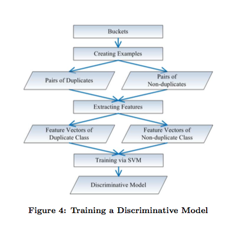

# SUMMARY

## (i) Chengnian Sun , David Lo , Xiaoyin Wang , Jing Jiang , Siau-Cheng Khoo, A discriminative model approach for accurate duplicate bug report retrieval, Proceedings of the 32nd ACM/IEEE International Conference on Software Engineering, May 01-08, 2010, Cape Town, South Africa

## (ii) Keywords

* (ii1) **Reliability**: Reliability is an attribute of any computer-related component (software, or hardware, or a network, for example) that consistently performs according to its specifications.

* (ii2) **Triage**:This term has been introduced to software quality assurance to describe the function of assigning a priority and severity to new defects, usually by addressing several new defects at once every few days or as necessary.

* (ii3) **Bug repository**:A bug tracking system or defect tracking system is a software application that keeps track of reported software bugs in software development projects.

* (ii4) **Feature Extraction** :Feature extraction is the process of defining a set of features, which will most efficiently or meaningfully represent the information that is important for analysis and classification.

## (iii) Artifacts:

* (iii1) **Motivational Statements**:
          In order to help track software defects and build more reliable systems, bug tracking tools have been introduced. Despite the benefits of a bug reporting system, it does cause some challenges. As bug reporting process is often uncoordinated and ad-hoc, often the same bugs could be reported more than once by different users. Hence, there is often a need for manual inspection to detect whether the bug has been reported before. If the incoming bug report is not reported before then the bug should be assigned to a developer. However, if other users have reported the bug before then the bug would be classified as being a duplicate and attached to the original first-reported “master” bug report. This process referred to as triaging often takes much time.

* (iii2) **Related Work**:

* Textual bug reports via natural language processing techniques: P. Runeson, M. Alexandersson, and O. Nyholm. Detection of Duplicate Defect Reports Using Natural Language Processing. In proceedings of the International Conference on Software Engineering, 2007.

* Extended the previous work to two dimensions. First they considered not only TF, but IDF: X. Wang, L. Zhang, T. Xie, J. Anvik, and J. Sun. An Approach to Detecting Duplicate Bug Reports using Natural Language and Execution Information. In proceedings of the International Conference on Software Engineering, 2008.

* two dimensions. First, they proposed a new term-weighting scheme and clustering and classification techniques to filter duplicates.: N. Jalbert and W. Weimer. Automated Duplicate Detection for Bug Tracking Systems. In proceedings of the International Conference on Dependable Systems and Networks, 2008.

* (iii3) **Visualizations**:
          

* (iii4) **Future Work**:

As a future work, we plan to investigate the utility of paraphrases in discriminative models for potential improve- ment in accuracy.

## (iv) Improvements:

* (iv1) No information was provided to repeat the experiment.

* (iv2) The experiment werent tried on any other programming language.

* (iv3) The dataset links aren't provided in the paper.
