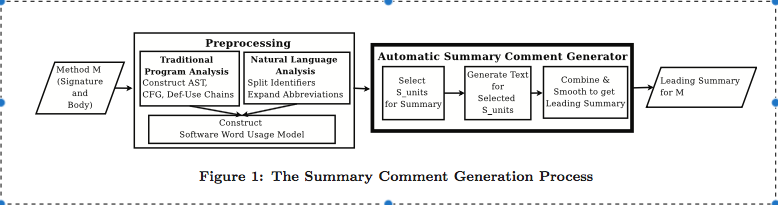

# SUMMARY

## (i) G. Sridhara, E. Hill, D. Muppaneni, L. Pollock, and K. Vijay-Shanker, "Towards automatically generating summary comments for java methods," in Proceedings, ASE, 2010.

## (ii) Keywords

* (ii1) **Top down design**: The software design technique which aims to describe functionality at a very high level, then partition it repeatedly into more detailed levels one level at a time until the detail is sufficient to allow coding.

* (ii2) **Exception Handling**: Exception handling is the process of responding to the occurrence, during computation, of exceptions – anomalous or exceptional conditions requiring special processing – often changing the normal flow of program execution. It is provided by specialized programming language constructs or computer hardware mechanisms.

* (ii3) **Method**: A method in object-oriented programming (OOP) is a procedure associated with an object class.

* (ii4) **Comments** : In computer programming, a comment is a programmer-readable annotation in the source code of a computer program. They are added with the purpose of making the source code easier to understand, and are generally ignored by compilers and interpreters.

## (iii) Artifacts:

* (iii1) **Motivational Statements**:
        Software maintenance demands as much as 90% of soft- ware engineering resources , and much of this time is spent understanding the maintenance task and any related software or documentation. In spite of numerous studies demonstrating the utility of comments for understanding software , few software projects adequately document the code to reduce future maintenance costs. There are a number of ways to overcome insufficient comments. One approach is to obviate comments by using extremely descriptive identifier names. Another way is to encourage the developer to write comments by automatically prompting the developer to enter them. Although these solutions can be used to comment newly created systems, they are not suitable for existing legacy systems.

* (iii2) **Related Work**:

        * Semi-automated approaches either automatically determine uncommented code segments: D. Roach, H. Berghel, and J. R. Talburt. An Interactive Source Commenter for Prolog Programs. SIGDOC Asterisk J. Comput. Doc., 14(4), 1990.
        
        * Automatically generate comments from high level abstractions: P. N. Robillard. Schematic Pseudocode for Program Constructs and its Computer Automation by SCHEMACODE. Commun. ACM, 29(11), 1986.
        
        * Generating comments for legacy code: F. Long, X. Wang, and Y. Cai. API Hyperlinking via Structural Overlap. Foundations of Software Engineering (FSE), 2009.

* (iii3) **Visualizations**:
          

* (iii4) **Future Work**:

        In the future, we will improve content selection by exclud- ing if blocks handling special cases and error return paths, by possibly leveraging branch execution frequency estimation. For improved text generation, we are developing more precise action and theme identification. We will endeavor to make the summaries look more like human-written comments by applying smoothing techniques. We will investigate the feasibility of utilizing the generated leading comments at call sites. Lastly, we will extend the evaluation to longer methods, a larger number of methods and include novices in the evaluation.

## (iv) Improvements:
