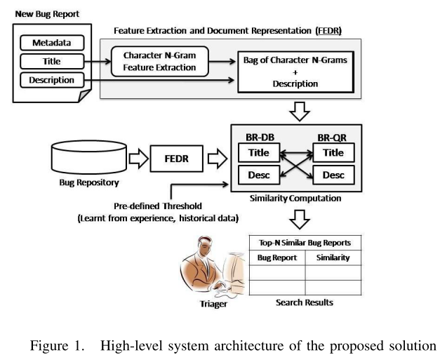
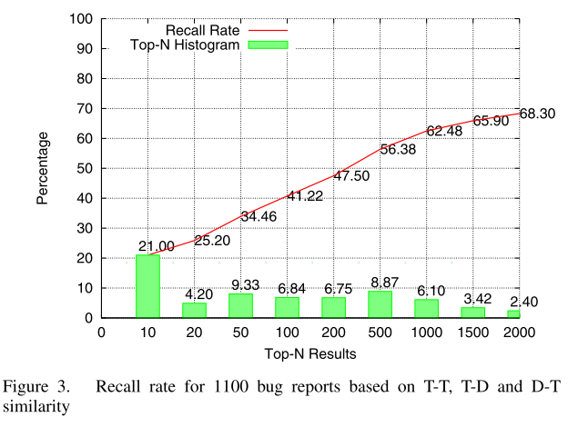

# SUMMARY

## (i)  Reference: A. Sureka and P. Jalote, “Detecting duplicate bug report using character n-gram-based features,” in Proceedings of the 2010 Asia Pacific Software Engineering Conference, 2010

## (ii) Keywords

* (ii1) **Triager** : A trained and knowledgeable analyst who has the knowledge of the system, project and developers.

* (ii2) **Report Quality check** : It is a check performed on the bug report to ensure if the report contains all the useful and required information.

* (ii3) **Duplicate Bugs**: Two bug reports are said to be duplicates if they describe the same issue or problem and thereby have the same solution to fix the issue.

* (ii4) **Semantic similarity**: It is a metric defined over a set of documents or terms, where the idea of distance between them is based on the likeness of their meaning as opposed to similarity which can be estimated regarding their syntactical representation.

## (iii) Artifacts

* (iii1) **Motivational Statements**:

Defect reporting is an integral part of a software development, testing and maintenance process. Typically, bugs are reported to an
issue tracking system which is analyzed by a Triager for performing activities like quality check, duplicate detection, routing it to the appropriate expert for necessary corrections.  Studies show that the percentage of duplicate bug reports can be up-to 25-30% which
can significantly hamper the bug fixing process and product release. Filtering duplicates in complex and large projects requires considerable amount of Triager's manual effort. Solutions for automating the process of duplicate detection can result in increased productivity of the Triager, speed-up the process of defect management and thus result in reduced software maintenance cost. Since bug reports are primarily expressed in natural language text, there has been a considerable research interest in the application of natural language processing and text analytics techniques for the purpose of duplicate bug report detection. The aim of the research study presented in this paper is to investigate novel text mining based approaches to analyze bug databases to uncover interesting patterns and knowledge which can be used to support developers and triagers in identification of duplicate bug reports.

* (iii2) **Related Work**:

  * Ahmed E. Hassan and Tao Xie. Mining software engineering data. In Proceedings of the 32nd International Conference on Software Engineering (ICSE 2010), Companion Volume, Tutorial, Cape Town, South Africa, May 2010.

  * Huzefa Kagdi, Michael L. Collard, and Jonathan I. Maletic. A survey and taxonomy of approaches for mining software repositories in the context of software evolution. volume 19, pages 77–131, New York, NY, USA, 2007. John Wiley & Sons, Inc.

  * Lyndon Hiew. Assisted detection of duplicate bug reports.In MS Computer Science Thesis, Department of Computer Science, British Columbia, Canada, 2003. The University of British Columbia.

  * Per Runeson, Magnus Alexandersson, and Oskar Nyholm. Detection of duplicate defect reports using natural language processing. In ICSE ’07: Proceedings of the 29th international conference on Software Engineering, pages 499–510, Washington, DC, USA, 2007. IEEE Computer Society.

  * Xiaoyin Wang, Lu Zhang, Tao Xie, John Anvik, and Jiasu Sun. An approach to detecting duplicate bug reports using natural language and execution information. In ICSE ’08: Proceedings of the 30th international conference on Software engineering, pages 461–470, New York, NY, USA, 2008. ACM.

* (iii3) **Visualizations**:

* (iii4) **Results**:

The figure below presents performance results for randomly selected 1100 duplicate bug reports (i.e., a random selection made from the set of all duplicate bug reports) without any predefined threshold. It presents the recall rate (based on T-T + T-D + D-T similarity) and histogram for Top-N results. 

## (iv) Improvements:

* (iv1) No  discussion about the fact that character level analysis could miss the context.

* (iv2) The model was tested only on one dataset. Comparison of results for different datasets would have been more insightful.

* (iv3) No discussion on how the work presented in this study can be further improved or used by researchers in the future.

## (v) Connection to other papers:

This paper processes only natural language text of the bug reports to produce a ranking of related bug reports. The first paper improves on this by considering not only text but also other features that are available in BugZilla like the component where the bug
resides, the version of the product and the priority of the report. The first paper also uses the same eclipse dataset as used in this paper to compare using the same benchmark.