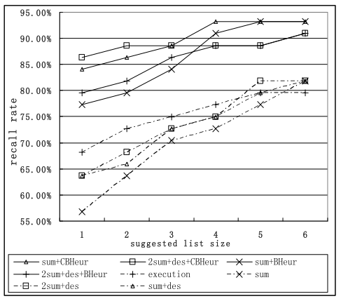
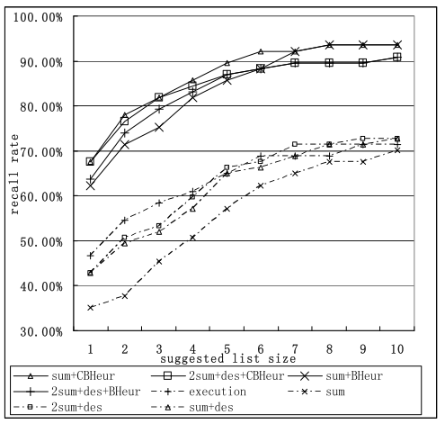

# SUMMARY

## (i)  Reference:  X. Wang, L. Zhang, T. Xie, J. Anvik, and J. Sun, “An Approach to Detecting Duplicate Bug Reports using Natural Language and Execution Information,” in proceedings of the International Conference on Software Engineering, 2008

## (ii) Keywords

* (ii1) **Bug repository**: A bug repository refers to the system that contains both fault reports and feature requests.

* (ii2) **Triager**: A trained and knowledgeable analyst who has the knowledge of the system, project and developers.

* (ii3) **Bug report** : It refers to the contents of bug repositories. 

* (ii4) **Execution information**:  It reflects  the  situation  and  internal  abnormal  behavior during  bug-revealing  runs  and  is  not affected by the variety of natural languages.

## (iii) Artifacts

* (iii1) **Motivational Statements**:

Neither natural language information nor execution information is always superior to the other in all cases. In particular, considering both kinds of information can have the following advantages. First, natural language information acquired from the bug description most likely represents the external buggy behavior observed by the bug reporter, while the corresponding execution information likely records the internal abnormal behavior. Thus, using both kinds of information can make it possible to consider both external and internal behaviors in duplicate-bug-report detection. Second, as descriptions in natural languages often contain uncertainty and imprecision, execution information, which is typically certain and precise, may help reduce the uncertainty and imprecision in existing duplicate detection approaches. Moreover, distinguishing which kind of information is the dominant factor may further facilitate duplicate-bug-report detection.
	
* (iii2) **Related Work**:

  * Greengrass, E. Information Retrieval: A Survey, University of Maryland, Baltimore County, 2000.

  * Hiew, L. Assisted Detection of Duplicate Bug Reports. Master’s thesis, University of British Columbia, Canada, 2006.

  * Raghavan, V., Wong, M. A critical analysis of vector space model for information retrieval. Journal of the American Society for Information Science, 37, 5: p279-287, 1986.

  * Runeson, P., Alexanderson, M., Nyholm, O. Detection of Duplicate Defect Reports Using Natural Language Processing. In Proc. ICSE, 2007, 499-510.

* (iii3) **Baseline results**:

To calibrate the approach experimentally, bug reports were chosen from eclipse and firefox repositories.

The following picture depicts the recall rates obtained using different similarity measures in eclipse. The data contained 220 bug reports with 44 pairs of duplicate bug reports from eclipse bug repository during June 2004.

Similarly, the following picture depicts the recall rates obtained using different similarity measures in firefox. The data contained 1492 bug reports with 744 pairs of duplicate bug reports from firefox bug repository between Jan 1 2004 and Apr 1 2004.

* (iii4) **Future work**:

	* Conducting experiment on larger sets and deploying the tool on some open source projects to see if triagers benefit from our approach.
	* Other areas like automated bug assignment and bug prioritization may also benefit from the technique described.

## (iv) Improvements:

* (iv1) The size of the dataset used to test the performance could have been bigger in case of eclipse.

* (iv2) The experimental setup and dataset could have been uploaded to a public repository for reference.

* (iv3) No discussion on the handling of domain specific term variations.

## (v) Connection to other papers:

The first paper uses the feature vector construction approach described in this paper where each feature is computed by considering both term frequency (TF) and inverse document frequency (IDF) of the words in the bug reports. The first paper also outperforms the techniques used in this paper when used for firefox and eclipse bug reports.