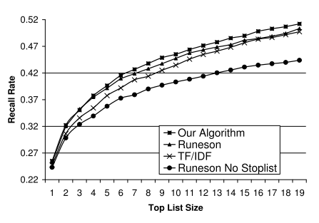

# SUMMARY

## (i)  Reference:  N. Jalbert and W. Weimer, “Automated Duplicate Detection for Bug Tracking Systems,” in proceedings of the International Conference on Dependable Systems and Networks, 2008.

## (ii) Keywords

* (ii1) **Classifier**: It is an algorithm that implements classification of data, especially in a concrete implementation.

* (ii2) **Software maintenance**: It is the modification of a software product after delivery to correct faults, to improve performance or other attributes.

* (ii3) **Software dependability**: It is a measure of a system's availability, reliability, and its maintainability.

* (ii4) **Clustering**: It is the task of grouping a set of objects in such a way that objects in the same group are more similar to each other than to those in other groups.

## (iii) Artifacts

* (iii1) **Motivational Statements**:

The analysis of the "Most Frequently Reported Bugs" page of the Mozilla Project’s Bugzilla bug tracking system revealed that 42 defect reports were submitted describing the same bug from among the thirty thousand bug reports over a period of 9 months. In commercial develpment processes with a team of bug triagers and software maintainers, it is not reasonable to expect any single developer to have thirty thousand defects from the past nine months memorized for the purposes of rapid triage. We propose a formal model for reasoning about duplicate bug reports. The model identifies equivalence classes based predominantly on textual similarity, relegating surface features to a supporting role.
	
* (iii2) **Related Work**:

  * J. Anvik, L. Hiew, and G. C. Murphy. Coping with an open bug repository. In OOPSLA workshop on Eclipse technology eXchange, pages 35–39, 2005.

  *  G. Canfora and L. Cerulo. How software repositories can help in reoslving a new change request. In Workshop on Empirical Studies in Reverse Engineering, 2005.

  * P. Hooimeijer and W. Weimer. Modeling bug report quality. In Automated software engineering, pages 34–43, 2007.

  *  C. Weiß, R. Premraj, T. Zimmermann, and A. Zeller. How long will it take to fix this bug? In Workshop on Mining Software Repositories, May 2007.

* (iii3) **Statistical tests**:

 To develop a model of bug report similarity, a linear regression was employed over properties of bug reports as the basis for the classifier. Linear regression offers several advantages allowing for a qualitative analysis of the features in the model.  Linear regression produces continuous output values as a function of continuously-valued features; to make a binary classifier we need to specify those features and an output value cutoff that distinguishes between duplicate and non-duplicate status. The classification involves textual similarity analysis, document similarity analysis and clustering. Bag of words approach is used when defining similarity between textual data. Each document in the corpus is represented by a vector v of size n, with v[i] related to the total number of times that word i occurs in that document. Similarity of two documents is calculated by taking the dot product of its vectors.

* (iii4) **Baseline results**:

The experiments were based on 29,000 bug reports from the Mozilla project that span an eight month period from February 2005 to October 2005. The following figure depicts the recall rate of various algorithms on the Runeson task as a function of top list size. Our algorithm performs up to 1% better than that of Runeson et al., which in turn performs better than a direct application of inverse document frequency (TF/IDF).

## (iv) Improvements:

* (iv1) No discussion on how the work presented in this study can be further improved or used by researchers in the future.

* (iv2) The bag of words approach loses the semantic information for later use. In some cases, this information is required to analyse the context.

* (iv3) The model was tested only on one dataset. Comparison of results for different datasets would have been more insightful.

## (v) Connection to other papers:

The first paper uses the feature vector construction approach described in this paper  where each feature is computed by the following
formula: 3+2 * log (TF(word)). The first paper also outperforms the techniques used in this paper when used for firefox bug reports.