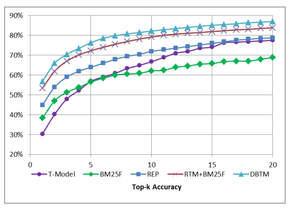

# SUMMARY

## (i)  Reference:  A. Nyugen, D. Lo and C. Sun, "Duplicate Bug Report Detection with a Combination of Information Retrieval and Topic Modeling" in ASE 2012.

## (ii) Keywords

* (ii1) **Information Retrieval**: It is the activity of obtaining information resources relevant to an information need from a collection of information resources.

* (ii2) **Reliability**: It is the probability of failure-free software operation for a specified period of time in a specified environment.

* (ii3) **Topic model**: It is a type of statistical model for discovering the abstract "topics" that occur in a collection of documents.

* (ii4) **Vector Space Model**: It is an algebraic model for representing text documents (and any objects, in general) as vectors of identifiers.

## (iii) Artifacts

* (iii1) **Motivational Statements**:

Detecting duplicate bug reports has benefits in software maintenance. Duplicate bug reports filed by people with different points of view and experience could provide different kinds of information about the bug, thus, help in the fixing process. Importantly, detecting such duplications will help avoid redundant bug fixing efforts.
	
* (iii2) **Related Work**:

  *  L. Hiew. Assisted detection of duplicate bug reports. Master’s thesis, University of British Columbia, 2006.

  *   N. Jalbert and W. Weimer. Automated duplicate detection for bug tracking systems. In Int. Conf. on Dependable Systems and Networks, pp. 52–61. 2008.

  *  P. Runeson, M. Alexandersson, and O. Nyholm. Detection of duplicate defect reports using natural language processing. In ICSE’07. IEEE CS, 2007.

  *  C. Sun, D. Lo, S.-C. Khoo, and J. Jiang. Towards more accurate retrieval of duplicate bug reports. In ASE’11, pages 253–262. IEEE CS, 2011.

* (iii3) **Statistical tests**:

 In order to train algorithm for Topic model, Gibbs sampling was used and we extend the training algorithm in LDA to support our DBTM. The algorithm then iteratively estimates every parameter based on the distribution calculated from other sampled values. The iterative process terminates when the estimated values converge, that is when the sum of the differences between of the current estimated topic distributions and previous estimated ones is smaller than a threshold. The prediction algorithm uses the trained model from the previous algorithm to estimate the topic proportion of new , and uses the Jensen-Shannon divergence to calculate the topic similarity between  new and each bug report in all groups of duplicate reports. The similarity sim 1 , in combination with BM25F-based similarity sim 2 , will be used to estimate how likely the new bug can be a duplicate of the reports in the group.

* (iii4) **Baseline results**:

 The following figure depicts the accuracy result of DBTM in comparison with REP on Eclipse data set. The model can relatively improve REP by up to 20% in accuracy. The performance of the model on the datasets of Open office and Mozilla also showed similar results.

## (iv) Improvements:

* (iv1) No discussion on how the work presented in this study can be further improved or used by researchers in the future.

* (iv2) The dataset used for the evaluation is neither discussed nor made available to the public.

* (iv3) The system execution conditions under which the bugs occured were not taken into consideration.