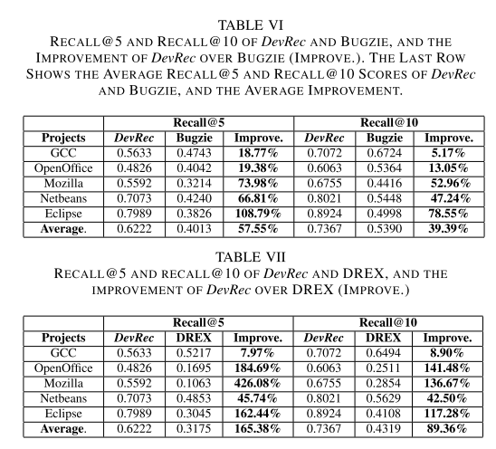

# SUMMARY

## (i)  Reference:  X. Xia et al "Accurate Developer Recommendation for Bug Resolution" in WCRE 2013.

## (ii) Keywords

* (ii1) **Bug resolution**: It  refers to the activity that developers perform to diagnose, fix, test, and document bugs during software development and maintenance.

* (ii2) **Developer Recommendation**: The task of recommending the set of bug resolvers that could potentially contribute their knowledge to fix the bug.

* (ii3) **Multi-label Learning**: It is a form of supervised learning where the classification algorithm is required to learn from a set of instances, each instance can belong to multiple classes and so after be able to predict a set of class labels for a new instance.

* (ii4) **Euclidean Distance**: It is the "ordinary" (i.e. straight-line) distance between two points in Euclidean space.

## (iii) Artifacts

* (iii1) **Motivational Statements**:

As there are many bug reports requiring resolution and potentially hundreds or even thousands of developers working on a large project, it is non-trivial to assign a bug report to the appropriate developers.
	
* (iii2) **Related Work**:

  *  W. Wu, W. Zhang, Y. Yang, and Q. Wang, “DREX: Developer recommendation with k-nearest-neighbor search and expertise ranking,” in
APSEC 2011.

  *  A. Tamrawi, T. Nguyen, J. Al-Kofahi, and T. Nguyen, “Fuzzy set and cache-based approach for bug triaging,” in ESEC/FSE 2011. 

  *  J. Anvik, L. Hiew, and G. Murphy, “Who should fix this bug?” in ICSE 2006.

  *  G. Jeong, S. Kim, and T. Zimmermann, “Improving bug triage with bug tossing graphs,” in ESEC/FSE 2009.

* (iii3) **Baseline results**:

The paper evaluates and compares the performance of DevRec with other state-of-art methods, namely Bugzie and DREX. The figure below shows the comparison numbers for recall@5 and recall@10. DevRec clearly out performs the other two methods for both the recall rates.

* (iii4) **Future work**:

 * Improve the effectiveness of DevRec further by integrating the LDA-GA method or by employing other text mining solutions.
 
 * Experiment with even more bug reports from more projects.

## (iv) Improvements:

* (iv1) The developer affinity score doesn't take into account the qualitative parameters of previously resolved bugs.

* (iv2) No comparative study for selecting the k-nearest neighbors prediction algorithm.

* (iv3) The details of the dataset used for evaluation are not clearly mentioned.