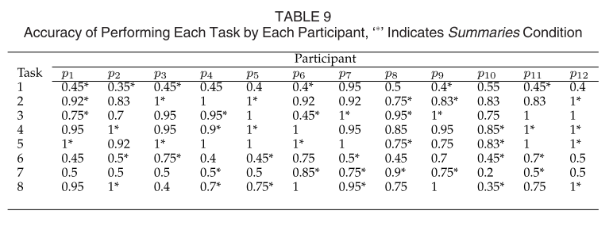

# SUMMARY

## (i)  Reference:  S. Rastkar, G. Murphy "Automatic Summarization of Bug Reports" in IEEE TRANSACTIONS ON SOFTWARE ENGINEERING 2014.

## (ii) Keywords

* (ii1) **Empirical software engineering**: Empirical software engineering is a related concept, sometimes used synonymously with experimental software engineering. It emphasizes the use of empirical studies of all kinds to accumulate knowledge

* (ii2) **Software artifact**: It is one of many kinds of tangible by-product produced during the development of software. Some examples of software artifacts are use cases, class diagrams and other UML models, requirements and design documents.

* (ii3) **Annotator**: A person who makes or furnishes critical or explanatory notes or comments.

* (ii4) **Recall**: It is a statistical measure of the fraction of relevant instances that are retrieved.

## (iii) Artifacts

* (iii1) **Motivational Statements**:

 When accessing the project’s bug repository, a developer often ends up looking through a number of bug reports, either as the result of a search or a recommendation engine. Typically, only a few of the bug reports a developer must peruse are relevant to the task at hand. Sometimes a developer can determine relevance based on a quick read of the title of the bug report, other times a developer must read the report, which can be lengthy, involving discussions amongst multiple team members and other stakeholders.In this paper, we investigate whether concise summaries of bug reports, automatically produced from a complete bug report, would allow a developer to more efficiently investigate information in a bug repository as part of a task.
	
* (iii2) **Related Work**:

  * A. Nenkova and K. McKeown, “Automatic Summarization,” Foundations and Trends in Information Retrieval, vol. 5, no. 2/3, pp.103-233, 2011.

  * X. Zhu and G. Penn, “Summarization of Spontaneous Conversations,” Proc. Ninth Int’l Conf. Spoken Language Processing              (Interspeech’06-ICSLP), pp. 1531-1534, 2006.

  * S. Wan and K. McKeown, “Generating Overview Summaries of Ongoing Email Thread Discussions,” Proc. 20th Int’l Conf. Computational LinguistNo option provided to the developer ics (COLING ’04), pp. 549-556, 2004 they require.

  * N. Bettenburg, R. Premraj, T. Zimmermann, and S. Kim, “Duplicate Bug Reports Considered Harmful; Really?” Proc. IEEE 24th Int’l Conf. Software Maintenance (ICSM ’08), pp. 337-345, 2008.

* (iii3) **Baseline results**:

The figure below shows the accuracy of performing each of the eight tasks by each of the 12 participants. The accuracy scores for
tasks performed under the summaries condition have been marked with a ‘*’.  On average, the accuracy of performing a task under
the originals condition is 0.752 (+ or - 24) while the accuracy of performing a task under the summaries condition is 0.766 (+ or - 23).

* (iii4) **Future work**:

 * Focus more on domain-specific features of bug reports to improve generated summaries.
 
 * Work towards generating abstractive summaries by identifying patterns that abstract over multiple sentences.

## (iv) Improvements:

* (iv1) Settings other than the duplicate detection task setting were not evaluated.

* (iv2) No comparative study done to evaluate the performance of developers on a task with access only to bug report descriptions
to their performance while having access to automatically generated summaries.

* (iv3) No option provided to the developers to adjust the length of summaries they require.